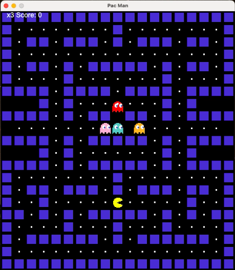
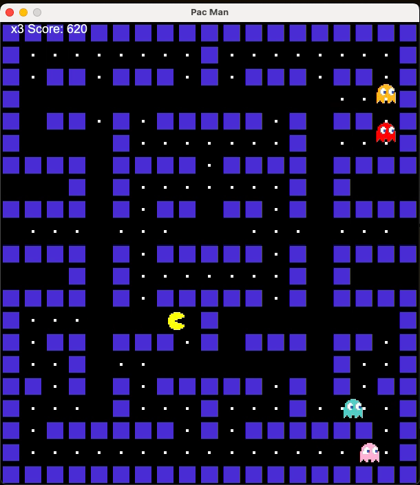
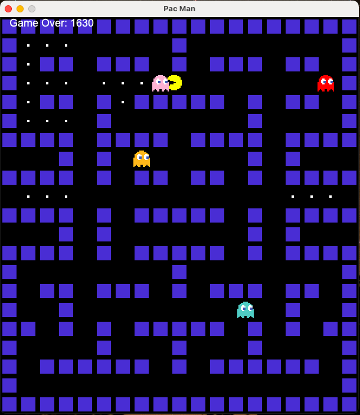

# PacMan Game - Java Swing

## Description
This is a PacMan game implemented using Java Swing. The game features a PacMan character, multiple ghosts, walls, and food items. The game includes collision detection for walls, ghosts, and food, and offers basic gameplay mechanics such as moving PacMan using arrow keys and eating food while avoiding ghosts. The game has a scoring system and multiple lives for the player.

## Features
- **Playable PacMan**: Navigate PacMan using arrow keys (Up, Down, Left, Right).
- **Ghosts**: Four different ghosts (Blue, Orange, Pink, Red) that move around the map.
- **Walls**: Maze-like walls that PacMan cannot pass through.
- **Food**: Collect food items to increase the score.
- **Scoring System**: Every food collected adds 10 points to the score.
- **Lives**: The player starts with 3 lives. If PacMan collides with a ghost, one life is lost.
- **Game Over**: When all lives are lost, the game ends.
- **Reset Game**: The game can be restarted after it ends.

## Learning Outcomes
During this project, I gained hands-on experience with:
- **Java Swing**: Building a graphical user interface (GUI) using Java Swing components.
- **Object-Oriented Programming (OOP)**: Designing and implementing the game using classes, methods, and objects, including the `Block` class that represents walls, food, and characters.
- **Game Mechanics**: Implementing basic game mechanics such as movement, collision detection, and interaction between different game entities (PacMan, ghosts, food).
- **Event Handling**: Managing keyboard events to control PacMan’s movement.
- **Collision Detection**: Writing logic to detect and handle collisions between PacMan, ghosts, and walls.

## Installation

To run this project locally, follow these steps:

1. Clone the repository:
    ```bash
    git clone https://github.com/prateekbisht004/PacMan-Game.git
    ```
2. Navigate to the project directory:
    ```bash
    cd PacMan-Game
    ```
3. Compile the Java code:
    ```bash
    javac PacMan.java
    ```
4. Run the game:
    ```bash
    java PacMan
    ```

Ensure you have the necessary images (walls, ghosts, and PacMan images) in the `./assets/` directory as referenced in the code.

## Gameplay

### Controls:
- **Arrow Keys**: Move PacMan (Up, Down, Left, Right).
  
### Scoring:
- Collect food (small blocks) for 10 points each.
- The game ends when all lives are lost.

### Game Over:
- Once the game is over, you can restart it by pressing any key.

## Screenshots

Here are some of the screenshots form the game itself!!

- When the game starts
  


- Im between of a round
  


- When the game gets over




**Play yourself and enjoy the Game!!**
*Feel free to report any bugs of ideas to improvement of this project!!*
